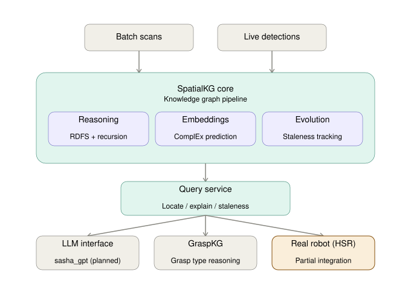

# Explainable Spatial Knowledge Graphs for Deterministic Robotic Action

Andrea Maggetto's project for TU Wien's "Knowledge Graphs" course (KG Lab,
Prof. Sallinger) - a perception-grounded spatial knowledge graph that acts
as a verifiable "System of Record" for the Toyota HSR ("Sasha"), so an LLM
interface (sasha_gpt) can query it instead of hallucinating where things
are. A secondary extension (GraspKG) hands off to grasp-type reasoning
once an object has actually been located.

Two pure-python KG cores, kept deliberately independent, plus their ROS1
wrappers:

```
spatialkg/           PRIMARY - spatial hierarchy, containment, reachability,
                      ComplEx-based occlusion prediction. This is what the
                      one-pager describes.
graspkg/              SECONDARY EXTENSION - grasp-affordance reasoning,
                      only invoked once spatialkg has located something.
scripts/, tests/      offline demo + evaluation scripts + pytest suite for both
ros/spatialkg_ros/    ROS1 package wrapping spatialkg/ - drop into catkin_ws/src/
ros/graspkg_ros/      ROS1 package wrapping graspkg/ - same
vadalog_reference/    the recursive rules in Vadalog's own syntax (untested -
                      real Vadalog access is commercial/gated, see below)
```

Neither `graspkg_ros` nor `spatialkg_ros` know about each other; the one
node that does is `spatialkg_ros/scripts/spatialkg_to_graspkg_handoff.py`,
by design - the coupling lives in exactly one place.

**ROS1 Noetic** is used in the real workspace at `~/HSR/catkin_ws`,
alongside PODGE, `haf_grasping`, `grasping_pipeline`, and `hsrb_moveit`.

## Architecture



`grasping_pipeline` (github.com/v4r-tuwien/grasping_pipeline) is the
actual execution layer this project hands off to once an object has been
located and its grasp type decided: it already wraps `haf_grasping` and
MoveIt internally, and exposes an LLM-facing `/robot_llm` action
(`use_llm_state_machine:=true`) that this repo's
`spatialkg_to_graspkg_handoff.py` calls directly - see "Why this dataset/
engine/embedding choice, specifically" below for what's verified vs. what
you'd need to confirm on your own workspace.

## Why this dataset/engine/embedding choice, specifically

- **3RScan/3DSSG :** 3RScan's actual purpose is
  re-localizing objects across rescans of the *same* room over time - which
  is exactly the problem in the Motivation ("where is the medicine"
  should come with "as of when, and how sure"). The ontology and
  `scene_loader.py` are built around 3DSSG's real relationship vocabulary
  (`standing on`, `inside`, `hanging on`, `attached to`) and its real
  `[subject_id, object_id, relationship_id, relationship_name]` format.
  3RScan itself needs an ETH/TUM license and isn't reachable from this
  sandbox, so `spatialkg/sample_data/sample_scene.json` is a hand-authored
  stand-in in the same shape, with two scans of one room so the re-localization
  behaviour (an object moving between scans) is actually exercised - point
  `scene_loader.load_scene_file` at the real files once you have them;
  nothing else changes.
- **Recursive rules:** `spatialkg/reasoning.py`
  materialises RDFS subclass entailment, then two rules expressed as
  SPARQL property paths with `+` (one-or-more) - the native way to get
  literally recursive closure for room propagation through arbitrarily
  long support chains, and for room-to-room reachability. `vadalog_reference/`
  has the same two rules hand-translated into Vadalog's own Datalog+/-
  syntax; since real Vadalog access is a commercial product (Prometheux
  Limited) gated behind contacting them for backend access, not something installable here.
- **ComplEx, not TransE.** `supportedBy`/`insideOf` are asymmetric (a table
  is not supportedBy a plate); ComplEx's complex-valued bilinear score
  handles that naturally where TransE's translation distance does not.
  Implemented from scratch in numpy (`spatialkg/embeddings.py`) for the
  same reason as before - fully inspectable for the write-up. See
  `scripts/evaluate_spatial_embeddings.py`'s leave-one-out results for how
  well it actually recovers held-out support relations on this (very
  small) sample scene.
- **The LLM is the interface, the KG is the memory.** `spatialkg/query_service.py`
  never returns a bare answer - every `LocationAnswer` carries `source`
  ("observation"/"embedding"/"none"), staleness, and a support chain, so
  "I don't know" and "this might be stale" are first-class answers, not
  failures. That's the whole point of the KG existing at all.
- **grasping_pipeline for execution:**
  Once GraspKG has decided a grasp type and confirmed pose consistency,
  `spatialkg_to_graspkg_handoff.py` (with `~trigger_grasp:=true`) calls
  grasping_pipeline's own `/robot_llm` actionlib server directly -
  `robot_llm.msg.RobotLLMAction(task='handover'|'placement', object_name=...)`
  - rather than reimplementing detection, pose estimation, grasp-point
  search, and arm motion in this repo. This was verified by reading
  grasping_pipeline's own source (`src/statemachine_llm.py`,
  `launch/grasping_pipeline_statemachine.launch`), not guessed: it
  confirmed grasping_pipeline already depends on and launches
  `haf_grasping` internally, so the two projects don't duplicate that
  integration - GraspKG's job is deciding *how* to grasp something and
  recording whether it worked (LO8); grasping_pipeline's job is actually
  doing it. `ros/graspkg_ros/scripts/haf_grasping_client.py` is kept only
  as a reference for driving `haf_grasping` directly, bypassing
  grasping_pipeline.

## Running the offline core (no ROS needed)

```bash
python3 -m venv .venv && source .venv/bin/activate
pip install -r requirements.txt
pip install -e .

pytest tests/ -v                            # 17 tests across both KGs
python3 scripts/run_spatial_demo.py         # spatial KG end to end
python3 scripts/evaluate_spatial_rules.py   # recursive-rule coverage + reachability closure size
python3 scripts/evaluate_spatial_embeddings.py  # leave-one-out link prediction (ComplEx)

python3 scripts/run_demo.py                 # secondary: grasp KG end to end
python3 scripts/evaluate_rules.py
python3 scripts/evaluate_embeddings.py
```

## Running on the real robot

See `ros/spatialkg_ros/README.md` (primary) and `ros/graspkg_ros/README.md`
(secondary) for setup and example `rosservice call` commands for trying
each piece without the other running. PODGE's perception interface (two
actionlib `robokudo_msgs/GenericImgProcAnnotatorAction` servers - object
detector then pose estimator) is confirmed from `grasping_pipeline`'s own
source, not guessed - see `TESTING.md` Phase 7 for the bring-up checklist.

## Learning-outcome mapping

| LO | Where it shows up |
|----|--------------------|
| LO1 KG Embeddings | `spatialkg/embeddings.py` (ComplEx), `scripts/evaluate_spatial_embeddings.py` |
| LO2 Logical Knowledge in KGs | `spatialkg/reasoning.py` (recursive SPARQL property-path rules), `vadalog_reference/` |
| LO4 Data Models | 3DSSG JSON -> RDF mapping in `scene_loader.py` |
| LO5 Architectures | this README's pipeline diagram + `ros/spatialkg_ros` + `ros/graspkg_ros` |
| LO6 Scalable Reasoning | `reasoning.run_rules` (fixpoint over recursive CONSTRUCT rules) |
| LO7 KG Creation | `scene_loader.py` (heterogeneous sources: 3DSSG-format scenes + live PODGE sightings + corrections) |
| LO8 KG Evolution | `spatialkg/evolution.py` (corrections), `reasoning.check_staleness` |
| LO9 Real-World Applications | the whole project, on a real HSR - SpatialKG's core is verified offline (tests/), PODGE's perception interface and grasp execution (via grasping_pipeline's real, already-running `/robot_llm` action) are both confirmed from source rather than guessed; sasha_gpt's own wiring into `locate_object` is the one remaining open unknown (see TESTING.md Phase 7) |
| LO11 Services | `query_service.py` + the ROS service layer sasha_gpt queries |
| LO12 Connections (AI/ML/DS) | perception (ML) -> KG (symbolic AI) -> evaluation scripts (DS-style metrics) |

LO3 (Graph Neural Networks) and LO10 (Financial KGs) are intentionally not
covered, per the one-pager.
